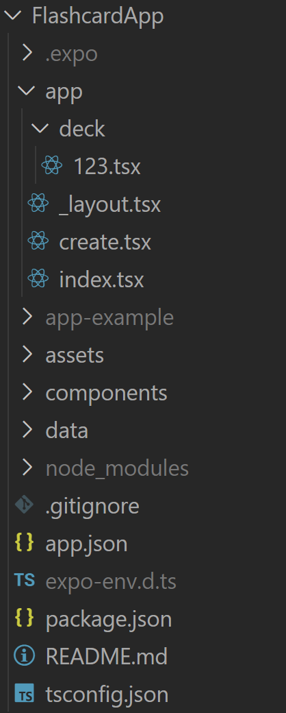

# Tag 1

### 1. GitHub
- GitHub Repository erstellen und Coaches als Collaborators einladen.
- Repository auf Laptop klonen:
  ```bash
  git clone git@github.com:bretscherjan/flashcard-app-API2-brejan.git
  ```
- Neuen Branch `day1` erstellen.
- `/docs` Dokumentations-Vorlage für jeden Tag erstellen.

### 2. Expo-Projekt aufsetzen
- Expo CLI installieren:
  ```bash
  npm install -g expo-cli
  ```
- Neues Expo-Projekt erstellen (im Ordner `FlashcardApp`. Falls ohne Ordner, dann `.` anstelle von `FlashcardApp` verwenden):
  ```bash
  npx create-expo-app FlashcardApp
  ```
- In den neuen Ordner `FlashcardApp` wechseln:
  ```bash
  cd FlashcardApp
  ```
- Expo-Server starten:
  ```bash
  npx expo start
  ```

Nach dem Start erschien ein QR-Code, den man mit der **Expo Go** App auf dem Smartphone scannen konnte. Dadurch war es möglich, die programmierte App live auf dem Smartphone zu testen, verbunden über das Netzwerk. Alternativ konnte das Preview auch über `localhost` geöffnet und getestet werden.

### 3. Projekt zurücksetzen und Ordnerstruktur anpassen
- Das Beispielprojekt auf einen leeren Stand zurücksetzen:
  ```bash
  npm run reset-project
  ```
- Die Ordnerstruktur nach Vorgabe aus Moodle anpassen:
  

### 4. Application Basics programmieren
- Grundlegende Funktionen in den neuen Dateien implementieren.
- Hauptaufgabe: **Routing zwischen verschiedenen Seiten** einrichten.

## Fazit
Ich finde es toll, dass wir nun das Processing abgeschlossen haben. Ich hatte einige Probleme beim Verbinden meines Codes mit der **Expo Go** App auf meinem Smartphone, da die Verbindung über das Netzwerk nicht funktionierte. Um die Mobile View trotzdem gut testen zu können, habe ich **Android Studio** installiert. Insgesamt haben die Aufgaben Spaß gemacht, und ich finde das Projekt einer Mobile-App sehr spannend!
